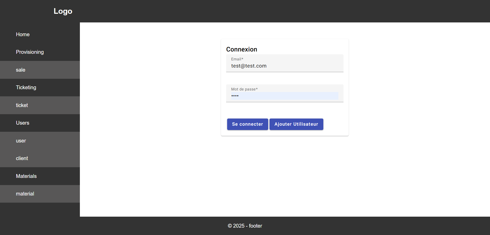
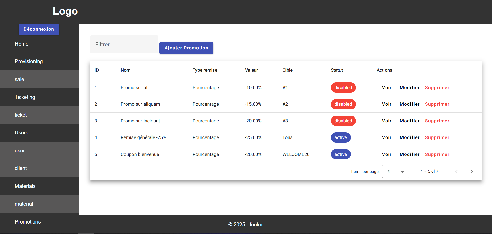
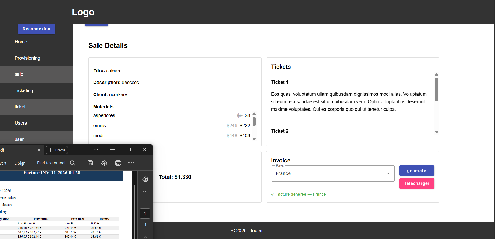
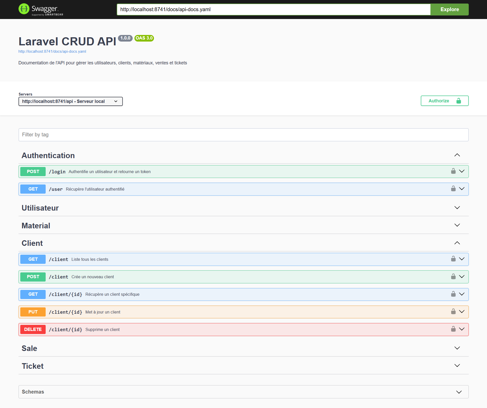
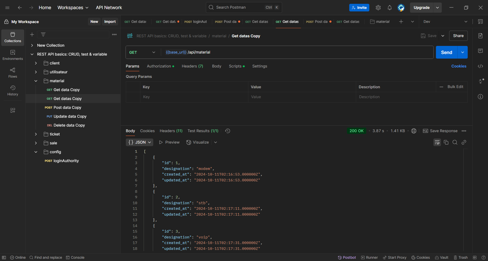
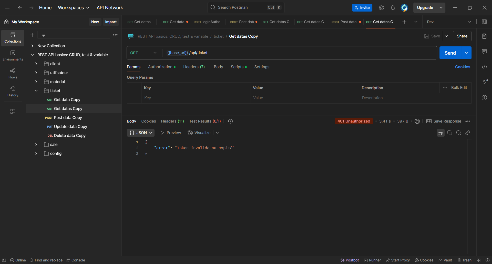
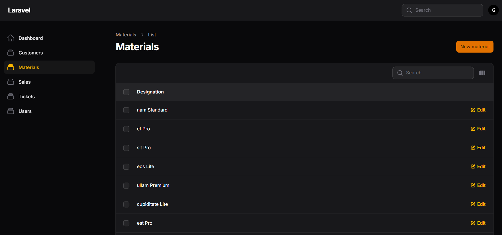
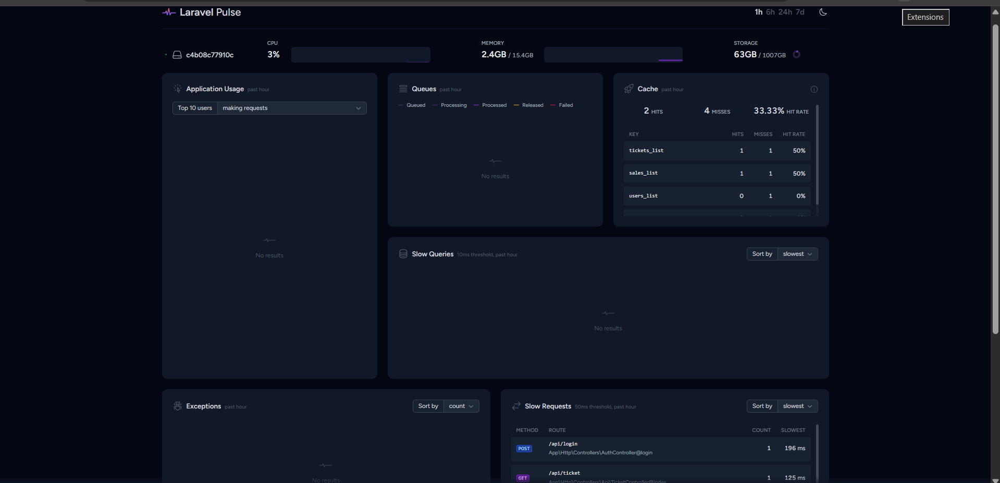

# 🚀 CRUD Docker Laravel 12 + Angular 19

Application CRUD complète avec API Laravel 12 (JWT), front-end Angular 19 et MySQL sous Docker.

## ✨ Nouveautés v2.0

- **Laravel 12** avec API JWT (migration depuis Laravel 10)
- **PHP 8.4** (upgrade depuis PHP 8.1)
- **Angular 19 (Standalone)** : Application front-end indépendante.
- **Angular 19 (Blade-integrated)** : Intégration hybride via **Vite** dans `app.blade.php`.
- **Pest** pour les tests automatisés
- **Swagger/OpenAPI** pour la documentation interactive de l'API
- **MySQL 8.0** optimisé
- **Architecture Docker** complète avec Apache
- **Filament v4** : Panneau d'administration complet et élégant (Alternative moderne à Laravel Nova)
- **Redis Cache** : Optimisation des performances avec mise en cache automatique via **Observers**.
- **CI/CD GitHub Actions** : Pipeline automatisé testant le Backend (Pest) et le Frontend (Angular) avec services MySQL & Redis.
- **Laravel Octane (Swoole)** : Intégration d'un serveur haute performance qui maintient l'application en RAM, offrant des temps de réponse quasi instantanés en éliminant les latences d'accès disque.
- **Laravel Pulse** : Tableau de bord de monitoring en temps réel pour surveiller la santé du système, les requêtes lentes et l'efficacité du cache d'un seul coup d'œil.
- **CORS** : Gestion optimisée du Cross-Origin Resource Sharing pour sécuriser les échanges entre le backend Laravel et le frontend Angular.
- **Promotions** : Ajout d'un système de promotion (coupon, global, materiel) sur les prix des materiels.
- **Génération Facture PDF (IA Groq)** : Système de création et téléchargement de factures PDF, structuré et optimisé par l'IA Groq.

## 📋 Stack Technique

**Back-end:**
- Laravel 12 avec API REST, Laravel Pulse/Octane/Filament/Cors
- PHP 8.4
- Authentification JWT
- Tests avec Pest
- Documentation Swagger/OpenAPI
- Redis

**Front-end:**
- Angular 19
- Authentification JWT (connexion/inscription)

**Infrastructure:**
- Docker & Docker Compose
- Apache
- MySQL 8.0
- phpMyAdmin
- Redis

## 🔧 Prérequis

- Docker
- Docker Compose

## 📦 Installation

1. **Cloner et préparer le projet :**
```bash
git clone https://github.com/ghyslain12/laravel-docker-apache-angular.git
sudo chmod -R 777 laravel-docker-apache-angular/
cd laravel-docker-apache-angular
```

2. **Construire et démarrer les conteneurs :**
```bash
docker-compose up --build -d
```

3. **Installer les dépendances Laravel :**
```bash
docker exec -it laravel_app sh -c "composer install"
# ou (à la racine du projet) 
docker compose run --rm app composer install
```

4. **Configuration de l'environnement :**
```bash
docker exec -it laravel_app sh -c "cp .env.example .env"
docker exec -it laravel_app sh -c "php artisan key:generate"
docker exec -it laravel_app sh -c "php artisan migrate"
```

## 🎮 Utilisation Docker

**Démarrer les services :**
```bash
docker-compose up
# ou en mode détaché
docker-compose up -d
```

**Arrêter les services :**
```bash
docker-compose down
```

**Voir les logs :**
```bash
docker-compose logs -f
```

## 🌐 Services Disponibles

| Service | URL | Description           |
|---------|-----|-----------------------|
| **Angular** | http://localhost:4200 | Interface utilisateur|
| **Laravel API** | http://localhost:8741/api | API REST |
| **Swagger** | http://localhost:8741/api/documentation | Documentation API interactive |
| **phpMyAdmin** | http://localhost:8080 | Gestion base de données |
| **Redis** | http://localhost:6379 | Serveur de cache haute performance |
| **Filament Admin** | http://localhost:8741/admin | Panneau d'administration |
| **Laravel Pulse**  | http://localhost:8741/pulse | Pulse tableau de bord |

## 🔐 Authentification JWT

### Configuration

Activer/désactiver JWT dans le fichier `.env` :
```env
# Activer JWT
JWT_ENABLE=true

# Désactiver JWT
JWT_ENABLE=false
```

### Endpoints d'authentification

 **`/api/login`** - Authentification et génération de token

 **`/api/register`** - Inscription d'un nouvel utilisateur

 **`/api/logout`** - Déconnexion et invalidation du token

 **`/api/me`** - Récupérer l'utilisateur authentifié

## 📡 API Endpoints

### Utilisateurs

 **`/api/utilisateur`** - Créer un utilisateur

 **`/api/utilisateur`** - Lister tous les utilisateurs

 **`/api/utilisateur/{id}`** - Récupérer un utilisateur

 **`/api/utilisateur/{id}`** - Mettre à jour un utilisateur

 **`/api/utilisateur/{id}`** - Supprimer un utilisateur

### Autres ressources disponibles
- Clients
- Matériel
- Tickets
- Ventes

> 📖 **Documentation complète** : [Swagger UI](http://localhost:8741/api/documentation)

## 🧪 Tests

Exécuter les tests avec Pest :
```bash
docker exec -it laravel_app sh -c "php artisan test"
```

## 🛠️ Commandes Utiles
```bash
# Accéder au conteneur Laravel
docker exec -it laravel_app sh

# Exécuter des migrations
docker exec -it laravel_app sh -c "php artisan migrate"

# Créer un contrôleur
docker exec -it laravel_app sh -c "php artisan make:controller NomController"

# Vider le cache
docker exec -it laravel_app sh -c "php artisan cache:clear"

# Générer la documentation Swagger
docker exec -it laravel_app sh -c "php artisan l5-swagger:generate"
```

## 📸 Aperçus


*Interface principale de l'application*


*Écran de connexion avec JWT*


*Écran de liste des promotions*


*Écran d'une vente + facture PDF*


*Documentation interactive de l'API*


*Authentification réussie*


*Token expiré ou invalide*


*Panel d'administration*


*Pulse Dashboard*

## 🐛 Dépannage

**Problème de dossier vendor backend manquant:**
```bash
docker compose run --rm app composer install
docker exec -it laravel_app composer dump-autoload
```

**Problème de permissions :**
```bash
sudo chmod -R 777 project/storage project/bootstrap/cache
```

**Réinstaller les dépendances :**
```bash
docker exec -it laravel_app sh -c "composer install --no-cache"
# ou (à la racine du projet) 
docker compose run --rm app composer install
```

**Reconstruire les conteneurs :**
```bash
docker-compose down -v
docker-compose up --build -d
```

**Problèmes d'affichage (Vite):**
```bash
# /project
npm install --legacy-peer-deps
npm run build
```

## 📝 Notes de Migration (v1.0 → v2.0)

- **PHP 8.1 → 8.4** : Vérifier la compatibilité des packages
- **Laravel 10 → 12** : Nouvelles fonctionnalités et améliorations de performance
- **Angular 19** : Support des dernières fonctionnalités standalone components


